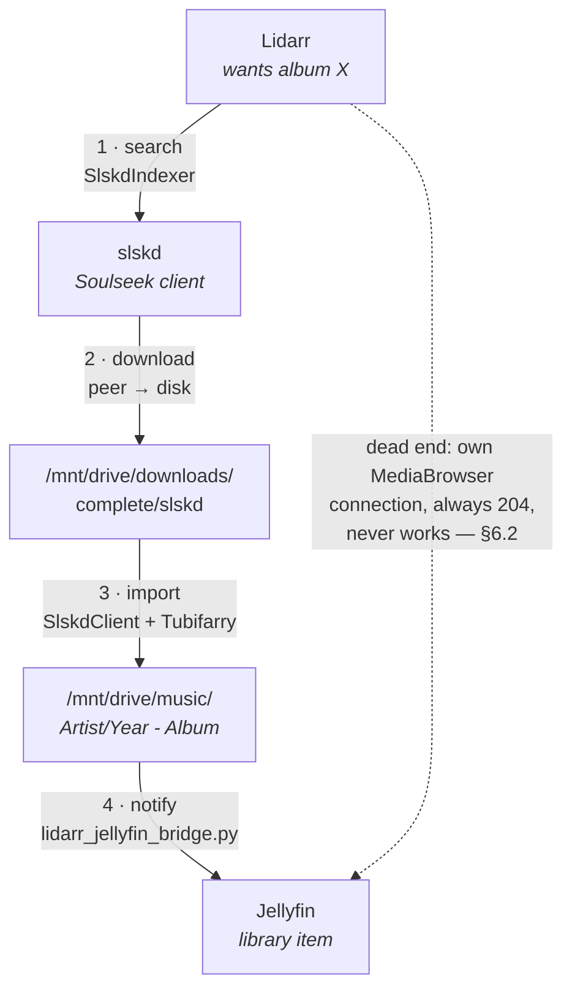

# The music pipeline: slskd ↔ Lidarr ↔ Jellyfin

How a music release gets from Soulseek onto disk, into Lidarr, and finally visible in
Jellyfin — every component, every path translation, and how to prove each stage works.

**Audited end-to-end 2026-09-04. Result: all four stages working, 0 albums missing from
Jellyfin across 15,268 on disk.** See [Audit log](#audit-log-2026-09-04) for the evidence.

This document exists because three of the four stages have failed silently at least once,
each time returning a success code while doing nothing. Read
[Failure modes](#failure-modes-and-their-tells) before changing anything here.

---

## 1. The shape of it



| #   | Stage           | Mechanism                                                             | Owner     |
| --- | --------------- | --------------------------------------------------------------------- | --------- |
| 1   | Search & grab   | Lidarr indexer `Slskd (Soulseek)` (id 4, Tubifarry plugin)            | Lidarr    |
| 2   | Download        | slskd pulls from Soulseek peers                                       | slskd     |
| 3   | Import          | Lidarr download client `Slskd` (id 2) + `process_soulseek_imports.py` | Lidarr    |
| 4   | Notify Jellyfin | `scripts/lidarr_jellyfin_bridge.py` (cron `2-59/5`)                   | host cron |

> **The single most important fact in this document: `EnableRealtimeMonitor` is `false`
> on every Jellyfin library.** Jellyfin is not watching the filesystem. Nothing appears in
> Jellyfin because it showed up on disk. **The bridge (stage 4) and the weekly per-library
> scan are the _entire_ surface between disk and Jellyfin** — if both miss a change,
> nothing else will catch it.
>
> Verified 2026-09-04 in `.docker-config/jellyfin/data/root/default/*/options.xml` and via
> `GET /Library/VirtualFolders`. Every other section assumes this; re-enabling real-time
> monitoring invalidates the reasoning here and puts the upstream 10.11.x
> full-rescan-on-new-item report (jellyfin#16729) back in scope — that concern is currently
> **refuted by configuration, not by version**.

Stage 4 is **not** Lidarr's own Jellyfin connection. That connection is wired up, enabled,
and structurally incapable of working — see [§6.2](#62-lidarrs-own-jellyfin-connection-is-decorative).

---

## 2. Three namespaces for one directory — the core hazard

`/mnt/drive/music` on the host is mounted into three containers under **three different
paths**. Almost every silent failure in this pipeline is a path from one namespace being
handed to a component that only understands another.

| Container    | Mount                                                  | Sees music as                   |
| ------------ | ------------------------------------------------------ | ------------------------------- |
| **Lidarr**   | `/mnt/drive → /data` _and_ `/mnt/drive/music → /music` | `/data/music` ← **root folder** |
| **slskd**    | `/mnt/drive/music → /music`                            | `/music`                        |
| **Jellyfin** | `/mnt/drive → /data/movies` (**ro**)                   | `/data/movies/music`            |

Consequences that are not obvious:

- Lidarr has **two** valid spellings for the same files (`/data/music` and `/music`). Its
  root folder is `/data/music` since the 2026-09-02 repath (ADR-0003). History records
  written before that say `/music`. The bridge maps **both**, longest-match-first.
- slskd has **no `/data` mount at all**. A `/data/...` path means nothing to it.
- Jellyfin's mount is **read-only** and its prefix (`/data/movies`) matches neither of the
  others. `/data/music` **does not exist inside the Jellyfin container** — verified
  2026-09-04. This is why stage 4 needs a translating script.

> **Do not "tidy" these mounts.** Jellyfin's `${SHARE_DIRECTORY}:/data/movies:ro` looks
> misnamed for music and is deliberate: Jellyfin library paths, the Sonarr/Radarr
> `mapFrom`/`mapTo` pairs, and playlist-generator's `LOCAL_PATH_PREFIX`/`JELLYFIN_PATH_PREFIX`
> are all calibrated to that exact string. ADR-0016, and the standing owner instruction in
> `compose/media-serve.yaml`.

---

## 3. Stage 1 — Lidarr searches, slskd answers

Lidarr reaches slskd as normal service DNS on `nas-network`: `slskd:5030`. There is no VPN
in front of either (the gluetun sidecar was removed 2026-07-27); both egress on the home IP.

**Indexer:** id 4, `Slskd (Soulseek)`, implementation `SlskdIndexer`, automatic search enabled.

Two of its fields are **load-bearing and must stay `False`**:

| Field               | Value   | Why         |
| ------------------- | ------- | ----------- |
| `useFallbackSearch` | `False` | ⚠️ keep off |
| `useTrackFallback`  | `False` | ⚠️ keep off |

With either enabled, Tubifarry expands one `AlbumSearch` into 4–15 near-duplicate queries.
Soulseek reads that as "quickly repeat a search" and issues a **30-minute ban** on the
account. Diagnosed and fixed 2026-06-17. These live in Lidarr's SQLite DB, **not in this
repo**, so a Lidarr config restore can silently reintroduce them — re-check after any
restore.

The same ban class was previously triggered by `lidarr_monitor_sweep.py` flooding
`ArtistSearch`; that is why its cron carries `--no-search`.

Never use `MissingAlbumSearch` — it is an unthrottled fan-out. Backlog searching is the
job of `lidarr_backlog_drip.py`, which gates on slskd's _live_ in-flight count staying
under 40.

---

## 4. Stage 2 — slskd downloads

```
incomplete → /downloads/incomplete/slskd   (= /mnt/drive/downloads/incomplete/slskd)
complete   → /downloads/complete/slskd     (= /mnt/drive/downloads/complete/slskd)
shares     → /music
```

slskd having its **own** incomplete directory is deliberate (the download-topology fix): it
keeps partial Soulseek data out of qBittorrent's tree, which was clogging with 1.4 TB
before the split.

### The login trap — read before touching the healthcheck

slskd's **web server can be healthy while its Soulseek login is dead.** It is tempting to
make the healthcheck probe `isLoggedIn` so a logged-out slskd gets auto-restarted. **That
creates a permanent restart spiral:**

1. slsknet holds a stale "ghost session" for the username after a fast restart.
2. The login handshake times out on a hardcoded 5000 ms.
3. A restart re-presents the same username and re-collides with the ghost.
4. Backoff climbs 32 → 64 → 128 s and never recovers. The container reports "Up N minutes"
   forever.

The **only** cure is to leave slskd **down for 15–30 minutes** so slsknet reaps the session,
then cold-start (`docker compose up -d slskd`).

Therefore, by design:

- slskd's healthcheck is **Soulseek-independent** (a web-UI spider).
- `autoheal=true` restarts it only if the **web server** dies.
- Login state is watched **alert-only** by `slskd_login_watch.py` (cron `*/15`), which
  never restarts anything.

Do not reintroduce a login-aware healthcheck on the autoheal path.

> **If you must stop autoheal** (e.g. slskd is mid-scan and must not be restarted):
> labels are immutable, so removing `autoheal=true` needs a container recreate — useless
> when the thing you are protecting _is_ the container. Stopping autoheal is then the only
> lever, and it is acceptable because `stack_watchdog.py` alerts on a missing container
> every 5 minutes. ADR-0026.

---

## 5. Stage 3 — slskd → Lidarr import

**Download client:** id 2, `Slskd`, implementation `SlskdClient`, `host: slskd`, priority 1.

Lidarr polls slskd for completed transfers and imports them into `/data/music` as
`Artist/Year - Album/NN - Track.ext`, writing `trackFileImported` (and usually
`trackFileRetagged`, since it rewrites tags on import) to its history.

`process_soulseek_imports.py` (cron `05:30` daily) handles what Lidarr's own polling
misses, with `--purge-not-upgrade` so rejected-as-not-an-upgrade grabs are cleaned rather
than left to rot.

### Why the reaper fleet exists

This stage clogs in three distinct ways, each with its own cron job:

| Clog                                                    | Job                               | Cron    |
| ------------------------------------------------------- | --------------------------------- | ------- |
| Lidarr `importFailed` rows blocking the queue           | `lidarr_queue_unstick.py`         | `:07`   |
| Download copies Lidarr already imported, still on disk  | `slskd_complete_sweep.py`         | `:22`   |
| Stale slskd transfer records + orphan incomplete dirs   | `slskd_cleanup.py`                | `:37`   |
| Grabs stuck at 0 bytes                                  | `lidarr_stuck_download_reaper.py` | `:52`   |
| Orphaned slskd folders that lost their Lidarr queue row | `process_soulseek_imports.py`     | `05:30` |

> **Corrected 2026-09-04.** This table previously credited `slskd_complete_sweep.py` with
> clearing `Completed,*` transfer records and `slskd_cleanup.py` with disk cruft. **They
> are the other way round**, per both docstrings and both logs: `complete_sweep` deletes
> _directories_ whose audio is fully represented under `/music` (disk reclaim of import
> hardlinks), and `cleanup` deletes _transfer records_. Anyone deciding which script to
> retire from the old table would have retired the wrong one — and given the retention
> finding below, that is the load-bearing one.

**Five** jobs share the **`flock` on `/tmp/nas-tubifarry-cleanup.lock`** — not three, not
four. `:07`, `:22` and `:37` take it with `flock -n` (skip silently if busy); `:52` uses
`flock -w 120` and `05:30` uses `flock -w 600`, so the 05:30 job can hold the lock well
into the `:37` window and make that run vanish without a trace.

> **The reaper marks failures deliberately.** A `downloadFailed` history entry reading
> `"Manually marked as failed"` is `lidarr_stuck_download_reaper.py` doing its job, **not**
> a spontaneous failure. Do not read the `downloadFailed` count as a health metric without
> checking that message field first.

`slskd_reaper` matching by **byte size does not work** — Lidarr re-tags files on import, so
the size changes. It matches on Lidarr import history instead.

### Normal-looking states that are not problems

- **All transfers `Queued, Remotely`, nothing active.** This is a peer's upload queue, not a
  clog. Soulseek uploaders queue requesters; waiting hours is routine.
- **`albumImportIncomplete`.** Usually a genuinely partial release on Soulseek (missing
  tracks), not a pipeline fault. The status message names the absent tracks.
- **`slskd_complete_sweep.py` logging `deleted 0/0 dirs` on every run.** 63 consecutive
  runs over four days deleted nothing. That is the script declining, not idling: the dirs
  are `below threshold=1.0`, i.e. not fully represented under `/music`, so they were never
  successfully imported and it correctly will not touch them.
- **`slskd_cleanup.py` logging `nothing to clean`.** Expected since 2026-09-02 — slskd's
  own `retention.transfers.*` now reaps the records first. Its rate decayed 21 → 2 → 1 as
  retention took over.

### slskd `retention` — half of it works, and the half that does not is why a script stays

Read the **running** config (`GET /api/v0/options`), never `slskd.yml`; a file on disk is
not evidence the process loaded it. Measured 2026-09-04 against slskd **0.26.0.0**:

| Clock                | Setting                          | Reality                                                                    |
| -------------------- | -------------------------------- | -------------------------------------------------------------------------- |
| **Transfer records** | `retention.transfers.download.*` | **Works.** DB down to 24 rows, all `Queued, Remotely`, zero `Completed,*`. |
| **Files on disk**    | `files.complete: 20160` (14 d)   | **Inert.** 75 dirs older, oldest **23.8 d**, holding 1.63 GB.              |
| **Files on disk**    | `files.incomplete: 43200` (30 d) | **Inert.** 1299 dirs, oldest **77.4 d**.                                   |

`docker logs slskd | grep -i '\bretention\b'` returns **zero** occurrences across a full
startup and 19 h of operation. (Beware false positives when grepping loosely — this
library contains Grim Reaper, _Don't Fear the Reaper_ and Portion Control's _Purge_.)

**Consequence: `slskd_complete_sweep.py` is load-bearing, not redundant.** It is the only
thing reclaiming disk. Retiring it in favour of native retention — which looked obviously
correct, and which the old §5 table pointed at the wrong script for — would have removed
the sole working reaper and left a growing orphan pile behind a config that reads fine.

The mechanism is **UNVERIFIED**: plausibly `transfers.succeeded: 1440` destroys the DB row
at 24 h, and file retention driven off that row can never see the bytes again. Unprovable
without a 14-day wait or a scratch instance, and it changes no action we would take. Filed
upstream; `make verify-runtime` pins the block so the day it starts working, an assertion
says so.

**`transfers.download.retry` is a trap of the same family.** The running config carries
`attempts=3, delay=5000, maxDelay=60000, partial=resume` — and `slskd.yml` has no `retry:`
block at all. Those are slskd's **own defaults**, and every measurement of the stuck reaper
silently assumes them. `scripts/check-slskd-effective-config.py` pins them for that reason.

---

## 6. Stage 4 — Lidarr → Jellyfin

### 6.1 The bridge

`scripts/lidarr_jellyfin_bridge.py`, cron `2-59/5` (every 5 min, offset 2), under
`flock /tmp/nas-lidarr-jf-bridge.lock`.

```
poll Lidarr /api/v1/history since cursor
  → keep file-level events:
      trackFileImported, trackFileRenamed, trackFileRetagged, trackFileDeleted
  → take each record's album folder
  → translate  /data/music|/music  →  /data/movies/music   (longest root wins)
  → POST one batch to Jellyfin /Library/Media/Updated
  → advance cursor only on success
```

Design details that matter:

- **It reports the album _folder_, not the library.** A full Music scan is the box's largest
  memory event (~1.56 GB anon-RSS) and must not run every 5 minutes.
- **A brand-new artist still costs a full Music scan.** LibraryMonitor resolves a reported
  path by walking _up_ to the nearest existing item. Existing artist + new album → only that
  artist refreshes. Brand-new artist → nothing exists above the album until the library root,
  so Jellyfin refreshes all of `/data/movies/music`. Measured 2026-09-03: backfilling 15
  folders across 8 new artists took anon-RSS from 2.3 → **4.19 GB in 9 minutes**, tripping
  the 4 GB `stack_watchdog` alert. It settled at ~2.87 GB, never near the 10 GB `mem_limit`.
  One new artist at a time is fine; a **bulk backfill will alert**.
- **An unmappable folder is `exit 2` with the cursor held**, never a warning. `cron_job.py`
  treats `0,1` as success, so a warning could not alert — which is exactly how a day of
  imports was lost (see [§7](#failure-modes-and-their-tells)).
- **`DEFAULT_MAP_FROM` is a tuple**, `("/data/music", "/music")`, so history written on
  either side of the ADR-0003 repath still maps. Longest root wins, so adding a broad
  `/data` cannot swallow `/data/music`.
- **`make verify-runtime` asserts Lidarr's live root is one the bridge can translate**
  (`scripts/check-lidarr-bridge-root.py`). This cannot live in `make check` — the root
  folder is a row in Lidarr's SQLite DB, invisible to the compose model.

### 6.2 Lidarr's own Jellyfin connection is decorative

Lidarr notification id 6, `Jellyfin` (`MediaBrowser`), has `onReleaseImport=True`,
`onTrackRetag=True`, `updateLibrary=True`. **It has never worked and cannot.**

Its complete field list is `apiKey, host, notify, port, updateLibrary, urlBase, useSsl` —
there is **no `mapFrom`/`mapTo`**, unlike Sonarr's and Radarr's connections, where those
fields are set and do the translation in-app. So Lidarr sends its own root spelling
(`/data/music/...`), and `/data/music` **does not exist inside the Jellyfin container**
(verified 2026-09-04: Jellyfin's only media mount is `/data/movies`). Jellyfin's
LibraryMonitor drops any path under no library **and still answers `204`**.

**Never read Lidarr's UI as evidence this integration works.** The connection looks correct,
tests green, and does nothing. The bridge does 100% of the work.

### 6.3 Deletes

| App        | Delete toggles                          | State                     |
| ---------- | --------------------------------------- | ------------------------- |
| Sonarr     | `onSeriesDelete`, `onEpisodeFileDelete` | `True` (fixed 2026-09-02) |
| Radarr     | `onMovieDelete`, `onMovieFileDelete`    | `True` (fixed 2026-09-02) |
| **Lidarr** | `onArtistDelete`, `onAlbumDelete`       | **`False` on purpose**    |

Lidarr's stay off for the same reason as §6.2 — enabling them would only send unmapped paths
that Jellyfin silently drops. Music deletion is the bridge's job, via the
`trackFileDeleted` event it already subscribes to.

**Verified end-to-end 2026-09-04 — deletes really do propagate.** This had never been
tested, and the bridge sends a hardcoded `UpdateType: "Modified"` for _every_ event
including `trackFileDeleted`, so "Modified for a path that no longer exists" was a
plausible silent no-op. It is not:

```
synthetic album under an EXISTING artist  ->  POST {Path, UpdateType: Created}  ->  item appears
rm -rf the folder  ->  POST {Path, UpdateType: Modified}  ->
  [INF] LibraryMonitor: "Kraftwerk" ... will be refreshed.
  [INF] LibraryManager: Removing item, Type: "MusicAlbum",
        Path: "/data/movies/music/Kraftwerk/9999 - ZZ Bridge Delete Probe"
```

133 ms between the two lines, item gone, album count back to its starting value.

**The attribution is clean because `EnableRealtimeMonitor` is `false` on every library**
(`.docker-config/jellyfin/data/root/default/*/options.xml`, confirmed via
`GET /Library/VirtualFolders`). Jellyfin is not watching the filesystem, so nothing but the
POST could have removed the item.

That fact is load-bearing well beyond this test: **every music change reaches Jellyfin
through the bridge or the weekly library scan, and through nothing else.** It also makes
the upstream 10.11.x "real-time monitor triggers a full rescan on any new item" report
moot on this box — the feature is off.

A safe way to repeat this test without touching real media: copy one small track into a new
folder under an **existing** artist (a brand-new artist costs a full Music scan, §6.1),
announce it, delete it, announce it again.

For Sonarr/Radarr, note that mapping decides **where** a call points; the per-event toggle
decides **whether** a call is made at all. `onEpisodeFileDelete=True` does **not** cover a
series delete: `DELETE /api/v3/series/N?deleteFiles=true` removes the folder in a single
`RecycleBinProvider` operation and raises only `SeriesDeletedEvent`.

---

## 7. Failure modes and their tells

| #   | Failure                                                           | Tell                                                                                                                                                    | Fixed                                        |
| --- | ----------------------------------------------------------------- | ------------------------------------------------------------------------------------------------------------------------------------------------------- | -------------------------------------------- |
| 1   | Lidarr sends `/music`, Jellyfin drops it, returns 204             | New albums on disk + in Lidarr, absent in Jellyfin                                                                                                      | 2026-09-01, bridge created                   |
| 2   | Repath `/music` → `/data/music`, bridge translated only `/music`  | `nothing to report` while the **cursor advances** across a window where imports demonstrably happened; `grep 'outside' logs/lidarr_jellyfin_bridge.log` | 2026-09-03, `MAP_FROM` tuple + exit 2        |
| 3   | Dropped folder warned and returned 0, so cron could not alert     | 7 Kraftwerk albums missing for a day, no alert                                                                                                          | 2026-09-03, unmappable → exit 2, cursor held |
| 4   | Delete events never dispatched                                    | Files gone, Jellyfin holds items on dead paths                                                                                                          | 2026-09-02, toggles on (Sonarr/Radarr)       |
| 5   | `lidarr-bulk` still posted `rootFolderPath: /music`               | **Every** artist add a hard `400`, `Root folder '/music' does not exist`                                                                                | 2026-09-03                                   |
| 6   | Tubifarry fallback fan-out                                        | Soulseek 30-min ban, "quickly repeat a search"                                                                                                          | 2026-06-17, both flags `False`               |
| 7   | Login-aware healthcheck on autoheal path                          | slskd restart spiral, never recovers                                                                                                                    | by design — healthcheck is login-independent |
| 8   | **The expiring guard** — the bridge's cursor hold released itself | **none.** No artifact to grep: the lost records were never fetched                                                                                      | 2026-09-04, exhaustion is exit 2             |
| 9   | Bridge cursor was a timestamp, and timestamps are not unique      | An import in the cursor's own second is skipped; nothing distinguishes it from a quiet window                                                           | 2026-09-04, cursor is a history `id`         |
| 10  | Corrupt cursor state read as "no state"                           | `nothing to report`, exit 0, and the cursor silently re-based to now-30min                                                                              | 2026-09-04, four distinct exit 2s            |

### 7.1 The expiring guard (#8) — a new failure class

Failures #2 and #3 were fixed by making an unmappable folder **exit 2 with the cursor
held**, so the album is retried rather than skipped. That guard had a shelf life.

```
unmapped folder → exit 2, cursor held → cursor ages while history grows
   → >2000 records newer than the cursor
   → fetch_history hits MAX_HISTORY_PAGES and returns only the newest 2000
   → the unmapped record is older than that window, so it is NOT in the record set
   → `unmapped` computes as EMPTY → the run "succeeds"
   → cursor jumps to the newest record, exit 0, THE ALERT STOPS
```

**A safety mechanism that expires into the exact bug it was guarding against.** The
longer the guard held, the closer it came to releasing itself, and the release looked
identical to the problem being fixed.

Its tell is worse than any other row in this table: **there is no artifact.** Failure #2
at least left `outside` lines in the log to grep. Here the lost records are never
fetched, so nothing in any log mentions them. The only signature was one stderr
`WARNING` line, on a run that exited 0.

Measured 2026-09-04 with a cursor of `2026-07-01`: 2000 records fetched, oldest
`2026-09-01T11:56:37Z`, 68 folders dispatched, **two months skipped**, exit 0.

**When auditing anything else in this stack, ask of every hold, retry ceiling, backoff
and cooldown: can the thing it is holding for fall outside the window that would detect
it?** If yes, the guard has an expiry date and the expiry is silent.

**The cursor-advances-silently signature (#2) needs care.** Cursor movement with
`nothing to report` is _normal_ when the only new history records are non-file events
(`grabbed`, `downloadFailed`, `albumImportIncomplete`) — the cursor tracks the newest record
of **any** type. It is only a fault signal when file-level imports happened in that window.
Always cross-check against `/api/v1/history` before concluding the bridge is broken.

**The general lesson from #2/#5:** the repath was verified exhaustively _inside_ Lidarr —
row counts across four tables, 1000/1000 sampled paths on disk, `ln` hardlink proof — and
every check passed. None asked what else in the stack had the old prefix compiled in.
**Blast radius of a path migration is every consumer that stored the prefix.**

---

## 8. Verification runbook

Each stage, with a check that produces real evidence rather than a green tick.

### 8.0 Prerequisites

```bash
cd /home/tom/nas
set -a; . ./.env; set +a          # API_KEY_LIDARR, API_KEY_SLSKD, API_KEY_JELLYFIN
. .venv/bin/activate
```

> **Lidarr's API is `v1`**, not `v3`. `curl .../api/v3/...` returns a bare `404` with an
> empty body, which looks exactly like the service being down. Sonarr and Radarr are `v3`.

### 8.1 Stage 1 & 3 — Lidarr ↔ slskd

```bash
# Lidarr healthy, and its root is where the bridge expects
curl -s -H "X-Api-Key: $API_KEY_LIDARR" http://localhost:8686/api/v1/health          # expect []
curl -s -H "X-Api-Key: $API_KEY_LIDARR" http://localhost:8686/api/v1/rootfolder      # expect /data/music

# slskd logged in to Soulseek (NOT just web-server healthy)
curl -s -H "X-API-Key: $API_KEY_SLSKD" http://localhost:5030/api/v0/application \
  | python3 -c 'import sys,json; print(json.load(sys.stdin)["server"]["state"])'
# expect: Connected, LoggedIn

# download client actually reachable — 200 + empty body {} means pass
BODY=$(curl -s -H "X-Api-Key: $API_KEY_LIDARR" http://localhost:8686/api/v1/downloadclient/2)
curl -s -w '\nhttp=%{http_code}\n' -X POST -H "X-Api-Key: $API_KEY_LIDARR" \
  -H 'Content-Type: application/json' -d "$BODY" \
  http://localhost:8686/api/v1/downloadclient/test

# the fallback flags that cause Soulseek bans are still off
curl -s -H "X-Api-Key: $API_KEY_LIDARR" http://localhost:8686/api/v1/indexer \
  | python3 -c 'import sys,json
for i in json.load(sys.stdin):
    f={x["name"]:x.get("value") for x in i.get("fields",[])}
    print(i["name"], "useFallbackSearch=",f.get("useFallbackSearch"), "useTrackFallback=",f.get("useTrackFallback"))'
# expect both False
```

**Throughput** (the real proof the stage moves): count event types in recent history.

```bash
curl -s -H "X-Api-Key: $API_KEY_LIDARR" \
  "http://localhost:8686/api/v1/history?page=1&pageSize=1000&sortKey=date&sortDirection=descending" \
  | python3 -c 'import sys,json,collections
d=json.load(sys.stdin); c=collections.Counter(r["eventType"] for r in d["records"])
print("oldest in window:", d["records"][-1]["date"])
[print(f"{v:6d}  {k}") for k,v in c.most_common()]'
```

Healthy shape: `trackFileImported` and `downloadImported` dominate; `downloadFailed` entries
should read `"Manually marked as failed"` (the reaper), not a real error.

### 8.2 Stage 4 — the bridge

```bash
# root folder is translatable (also runs inside `make verify-runtime`)
python scripts/check-lidarr-bridge-root.py
# expect: ok: /data/music covered by /data/music, /music

# exercise translate() without POSTing — throwaway state so --since-min applies
python scripts/lidarr_jellyfin_bridge.py --dry-run --since-min 2880 --state /tmp/bridge_test.json
```

Every line must read `changed: /data/movies/music/...`. A `/data/music/...` or `/music/...`
line, or any "outside root" complaint, means the mapping is broken.

> **`--since-min` is ignored if the state file already has a cursor.** Point `--state` at a
> throwaway path or you will just re-check the live cursor and always see
> `nothing to report`.

Confirm real reports landed:

```bash
grep -vE "^--- |nothing to report" logs/lidarr_jellyfin_bridge.log | tail -20
grep 'outside' logs/lidarr_jellyfin_bridge.log     # expect nothing after 2026-09-03 19:36
```

### 8.3 Did Jellyfin actually act? — verify by effect, not by log

> **Corrected 2026-09-04. `LibraryMonitor … will be refreshed` is an `[INF]` line and is
> being logged right now.** The premise was right and the conclusion wrong: there are
> genuinely zero `[DBG]` lines (`grep -c '\[DBG\]'` → `0`), but the LibraryMonitor line is
> not a Debug line, so its absence was never evidence of anything. Observed:
>
> ```
> [2026-09-04 11:34:52.487] [INF] Emby.Server.Implementations.IO.LibraryMonitor:
>     "Kraftwerk" ("/data/movies/music/Kraftwerk") will be refreshed.
> ```
>
> **No `logging.json` and no restart are needed to observe stage 4.** The bridge's own live
> dispatches appear in the log today — 05:33 and 10:15 on 2026-09-04, both for
> `/data/movies/music/Kraftwerk/1986 - Electric Cafe`.
>
> The one real caveat: the line is emitted when a reported path resolves to a library item
> **and the refresh finds a change**. A correct path whose folder is unchanged logs nothing,
> exactly like a bogus path. So the A/B discriminates only when there is a real change to
> find — which is the only case the bridge ever reports, so it is sufficient here.

**Use this instead.** For an album Lidarr just re-imported, only the files it actually
replaced get **new Jellyfin item entries**; untouched tracks keep their old `DateCreated`.

```bash
ALBUM='/data/movies/music/Kraftwerk/1986 - Electric Cafe'
AID=$(curl -s -H "X-Emby-Token: $API_KEY_JELLYFIN" \
  "http://localhost:8096/Items?Recursive=true&IncludeItemTypes=MusicAlbum&Fields=Path&Limit=20000" \
  | python3 -c "import sys,json
for i in json.load(sys.stdin)['Items']:
    if i.get('Path')=='$ALBUM': print(i['Id']); break")

curl -s -H "X-Emby-Token: $API_KEY_JELLYFIN" \
  "http://localhost:8096/Items?ParentId=$AID&Fields=Path,DateCreated&Limit=100" \
  | python3 -c 'import sys,json
for i in sorted(json.load(sys.stdin)["Items"], key=lambda x: x.get("Path") or ""):
    print(i.get("IndexNumber"), i.get("Name"), "| created", (i.get("DateCreated") or "?")[:19])'
```

Cross-check against `ls -la` on the host folder: the tracks with a fresh `DateCreated` must
be exactly the ones with a fresh mtime.

### 8.4 The whole-library sweep — "is anything actually missing?"

Check **both directions**. Disk → Jellyfin catches files with no item (how the missing
Kraftwerk albums would have been found). Jellyfin → disk catches ghosts. A one-directional
sweep cannot see the other class.

```bash
SP=/tmp/musicsweep; mkdir -p $SP

# Jellyfin side
curl -s -H "X-Emby-Token: $API_KEY_JELLYFIN" \
  "http://localhost:8096/Items?Recursive=true&IncludeItemTypes=MusicAlbum&Fields=Path&Limit=20000" \
  | python3 -c 'import sys,json
print("\n".join(sorted(i["Path"] for i in json.load(sys.stdin)["Items"] if i.get("Path"))))' > $SP/jf.txt

# Disk side — single traversal; a per-directory find loop takes >2 min and times out
find /mnt/drive/music -type f \
  \( -iname '*.mp3' -o -iname '*.flac' -o -iname '*.m4a' -o -iname '*.ogg' \
     -o -iname '*.opus' -o -iname '*.wav' -o -iname '*.wma' -o -iname '*.aac' \
     -o -iname '*.aif' -o -iname '*.aiff' \) \
  -printf '%h\n' | sort -u | sed 's|^/mnt/drive/music|/data/movies/music|' > $SP/disk.txt

python3 - <<'PY'
import re
SP="/tmp/musicsweep"
norm=lambda p: re.sub(r"/(?:Disc|CD|Disk)[ _]*\d+\s*$", "", p, flags=re.I)
disk={norm(l.strip()) for l in open(f"{SP}/disk.txt") if l.strip()}
jf={l.strip() for l in open(f"{SP}/jf.txt") if l.strip()}
print(f"disk {len(disk)}  jellyfin {len(jf)}")
print(f"ON DISK, NOT IN JELLYFIN: {len(disk-jf)}"); [print("  MISSING:",p) for p in sorted(disk-jf)[:40]]
print(f"IN JELLYFIN, NOT ON DISK: {len(jf-disk)}"); [print("  GHOST:",p) for p in sorted(jf-disk)[:40]]
PY
```

**Two traps that manufacture ~1,500 false positives:**

1. **Multi-disc albums.** Jellyfin registers the `MusicAlbum` at the _album_ folder; a disk
   walk yields `…/Disc 01`, `…/Disc 02`. Hence the `norm()` regex above. Without it, every
   multi-disc album shows as both a "missing" (the disc dirs) and a "ghost" (the album dir).
2. **`.aif` / `.aiff` are in this library.** Five albums here are aiff-only and appear as
   fake ghosts if the extension list omits them.

### 8.5 Config invariants and cron health

```bash
make check                        # 49 compose assertions; expect "invariants hold ... 0 warning(s)"
make verify-runtime               # asserts the RUNNING containers, incl. the bridge root
                                  # NOTE: pushes an ntfy alert on drift

# no supporting job is silently failing
for l in lidarr_jellyfin_bridge lidarr_queue_unstick slskd_complete_sweep \
         slskd_cleanup lidarr_stuck_download_reaper lidarr_backlog_drip; do
  echo "== $l"; grep -E "^--- .* exit=" logs/$l.log | tail -3
done
```

`exit=1` / `exit=2` bursts lasting exactly as long as a slskd outage are expected —
`ConnectionResetError` while slskd is down for a share scan. Persistent non-zero is not.

---

## 9. The cron fleet

Every entry must `cd /home/tom/nas` first, and every one is wrapped in `scripts/cron_job.py`
so a failure reaches ntfy. `cron_job.py --ok-codes` defaults to **`0,1`** — this is why a
genuine fault must exit **2**, not 1.

<!-- BEGIN GENERATED: cron-fleet -->

_Generated by `scripts/gen_pipeline_tables.py` from `cron/crontab`. 29 scheduled jobs._

| Schedule              | Job                        | Script                            | What it does                                                                   | `--ok-codes`    |
| --------------------- | -------------------------- | --------------------------------- | ------------------------------------------------------------------------------ | --------------- |
| `45 4 * * 0`          | `album-art`                | `album_art.py`                    | Download missing external album covers (folder.jpg) for the music library      | `0,1 (default)` |
| `0 1 * * *`           | `config-backup`            | `config_backup.py`                | Config backup & restore utility                                                | `0,1 (default)` |
| `0 3 * * 0`           | `docker-prune`             | `(shell command)`                 | —                                                                              | `0`             |
| `*/10 * * * *`        | `heartbeat`                | `heartbeat.py`                    | Ping an off-box dead-man's switch, so a dead host is noticed by something else | `0,1 (default)` |
| `5 5 * * 5`           | `jellyfin-scan-movies`     | `jellyfin_library_scan.py`        | Scan a single Jellyfin library (or all of them) via the API                    | `0,1 (default)` |
| `5 5 * * 0`           | `jellyfin-scan-music`      | `jellyfin_library_scan.py`        | Scan a single Jellyfin library (or all of them) via the API                    | `0,1 (default)` |
| `5 5 * * 6`           | `jellyfin-scan-tv`         | `jellyfin_library_scan.py`        | Scan a single Jellyfin library (or all of them) via the API                    | `0,1 (default)` |
| `12,27,42,57 * * * *` | `lidarr-backlog-drip`      | `lidarr_backlog_drip.py`          | Drip-feed Lidarr's missing-album backlog into Soulseek without flooding it     | `0,1 (default)` |
| `2-59/5 * * * *`      | `lidarr-jellyfin-bridge`   | `lidarr_jellyfin_bridge.py`       | Make Lidarr's imports actually reach Jellyfin, by fixing the path Lidarr sends | `0,1 (default)` |
| `5,20,35,50 * * * *`  | `lidarr-monitor-sweep`     | `lidarr_monitor_sweep.py`         | Re-monitor + search Lidarr artists that landed with nothing monitored          | `0,1 (default)` |
| `07 * * * *`          | `lidarr-queue-unstick`     | `lidarr_queue_unstick.py`         | Drop Lidarr queue items wedged in `completed / importFailed`                   | `0,1 (default)` |
| `52 * * * *`          | `lidarr-stuck-reaper`      | `lidarr_stuck_download_reaper.py` | Reap Lidarr grabs wedged forever at 0 bytes in slskd, and re-source them       | `0,1 (default)` |
| `0 2 * * 0`           | `log-pruner`               | `log_pruner.py`                   | Log size pruner / compressor                                                   | `0,1 (default)` |
| `*/5 * * * *`         | `media-ops-status`         | `media_ops_status.py`             | Unified media-ops status aggregator — stack health in one command              | `0,1 (default)` |
| `5 6 * * 0`           | `music-library-sweep`      | `music_library_sweep.py`          | Assert every album on disk is in Jellyfin, and every Jellyfin album is on disk | `0`             |
| `0 9 * * *`           | `notify-digest`            | `notify_digest.py`                | One markdown message a day, replacing everything that used to be chatter       | `0,1 (default)` |
| `12 * * * *`          | `playlist-album-tags`      | `playlist_sync_stage.py`          | Run ONE stage of the playlist-generator pipeline, in a bounded batch           | `0,1 (default)` |
| `*/30 * * * *`        | `playlist-lastfm-tracks`   | `playlist_sync_stage.py`          | Run ONE stage of the playlist-generator pipeline, in a bounded batch           | `0,1 (default)` |
| `42 * * * *`          | `playlist-release-dates`   | `playlist_sync_stage.py`          | Run ONE stage of the playlist-generator pipeline, in a bounded batch           | `0,1 (default)` |
| `30 4 * * *`          | `post-update-verifier`     | `post_update_verifier.py`         | Daily stack-health assertion: container state and HTTP reachability            | `0,1 (default)` |
| `30 5 * * *`          | `process-soulseek-imports` | `process_soulseek_imports.py`     | Process stuck Soulseek downloads and import them into Lidarr                   | `0,1 (default)` |
| `*/5 * * * *`         | `qbit-settings-enforce`    | `qbittorrent_settings_enforce.py` | Enforce qBittorrent Auto Torrent Management so categories drive save paths     | `0,1 (default)` |
| `37 * * * *`          | `slskd-cleanup`            | `slskd_cleanup.py`                | Clear stale slskd transfer records + matching orphan incomplete dirs           | `0,1 (default)` |
| `22 * * * *`          | `slskd-complete-sweep`     | `slskd_complete_sweep.py`         | Reap slskd download copies that Lidarr has already imported into /music/       | `0,1 (default)` |
| `*/15 * * * *`        | `slskd-login-watch`        | `slskd_login_watch.py`            | Alert when slskd is logged out of Soulseek — WITHOUT restarting it             | `0,1 (default)` |
| `30 3 * * *`          | `slskd-rescan`             | `slskd_rescan.py`                 | Trigger a slskd shared-library rescan                                          | `0,1 (default)` |
| `*/5 * * * *`         | `stack-watchdog`           | `stack_watchdog.py`               | Watch the whole compose stack and shout when something breaks                  | `0,1 (default)` |
| `15 6 * * *`          | `verify-runtime`           | `(shell command)`                 | —                                                                              | `0`             |
| `17 * * * *`          | `wan-shaper`               | `(shell command)`                 | —                                                                              | `0,1 (default)` |

**Locks.** A held lock is recorded as a skip, not silence (`cron_job.py --lock`); three consecutive skips alert.

| Lock                                 | Holders | Waiters                                                         |
| ------------------------------------ | ------- | --------------------------------------------------------------- |
| `/tmp/nas-album-art.lock`            | 1       | — (all non-blocking)                                            |
| `/tmp/nas-lidarr-backlog-drip.lock`  | 1       | — (all non-blocking)                                            |
| `/tmp/nas-lidarr-jf-bridge.lock`     | 1       | — (all non-blocking)                                            |
| `/tmp/nas-lidarr-monitor-sweep.lock` | 1       | — (all non-blocking)                                            |
| `/tmp/nas-music-sweep.lock`          | 1       | — (all non-blocking)                                            |
| `/tmp/nas-playlist-stage.lock`       | 3       | — (all non-blocking)                                            |
| `/tmp/nas-qbit-enforce.lock`         | 1       | — (all non-blocking)                                            |
| `/tmp/nas-stack-watchdog.lock`       | 1       | — (all non-blocking)                                            |
| `/tmp/nas-tubifarry-cleanup.lock`    | 5       | `lidarr-stuck-reaper` (120s), `process-soulseek-imports` (600s) |
| `/tmp/nas-wan-shaper.lock`           | 1       | — (all non-blocking)                                            |

**`--ok-codes`.** 3 of 29 jobs declare it explicitly; 26 inherit the `0,1` default, which swallows exit 1.

<!-- END GENERATED: cron-fleet -->

> The table above is **generated** by `scripts/gen_pipeline_tables.py` from
> `cron/crontab` plus each script's own docstring, and `make check` fails when the
> committed copy drifts. It is generated because the hand-written version pointed at
> the wrong script twice (see §5), and both times the docstrings were right.
> Regenerate with `python scripts/gen_pipeline_tables.py --write`.

`:07`, `:22`, `:37`, `:52` **and `05:30`** share **`flock /tmp/nas-tubifarry-cleanup.lock`**
so they never contend over the same queue rows — five holders, not four. `:52` uses
`flock -w 120` and `05:30` uses `flock -w 600` (both wait); `:07`/`:22`/`:37` use `flock -n`
(skip if busy).

> **A skipped run currently looks exactly like a clean run.** `flock -n` exits 1 without
> running anything, and the wrapper is inside the lock precisely so that is not read as
> success — but nothing counts skips, so a 05:30 job holding the lock for its full 600 s
> budget can silently erase the `:37` run. Lock-skip counting is an open item.

> **Only two of the 28 cron entries declare `--ok-codes`** (`docker-prune` and
> `verify-runtime`, both `0`). The other 26 inherit the `0,1` default — including
> `lidarr-jellyfin-bridge`. That default exists because `stack_watchdog.py` and
> `media_ops_status.py` legitimately exit 1, but it is applied far beyond them. This table
> documents 11 of the 28; the full inventory is an open item.

---

## 10. Do not change

- **Jellyfin's volume mappings** — `${SHARE_DIRECTORY}:/data/movies:ro`. ADR-0016.
- **`useFallbackSearch` / `useTrackFallback`** on Lidarr indexer id 4 — both `False`.
  Soulseek ban risk. Lives in Lidarr's DB, so re-check after any config restore.
- **slskd's healthcheck** — must stay Soulseek-login-independent.
- **Lidarr's `onArtistDelete` / `onAlbumDelete`** — stay `False` until its MediaBrowser
  connection gains `mapFrom`/`mapTo` fields upstream.
- **Lidarr in any Cleanuparr module** — must never be enabled. Its only client is slskd,
  which Cleanuparr cannot see. `failedImport.skipIfNotFoundInClient` must stay `True`.
- **The bridge's exit-2-on-unmappable-path behaviour** — reverting it to a warning
  re-creates failure #3.
- **The bridge's exit-2-on-`HistoryExhausted` behaviour** — returning a partial record set
  re-creates failure #8, the one with no artifact to grep. Raise `MAX_HISTORY_PAGES`
  instead; the alert tells you what to raise it to.
- **The bridge's cursor is a history `id`, not a date** — 600 live records held 125
  distinct dates and one second was shared by 22. A date comparison against a non-unique
  key silently drops whatever shares the cursor's second.
- **The bridge's state file is written with `os.replace`** — the non-atomic write and the
  "corrupt state reads as no state" fallback composed into a complete data-loss chain.
  Absent / empty / corrupt / future-schema must each stay fatal.
- **`slskd_complete_sweep.py` must not be retired in favour of slskd `retention`** — the
  file half of retention is inert on 0.26.0.0 and this script is the only thing reclaiming
  disk. See §5. Re-evaluate only when `check-slskd-effective-config.py` says otherwise.
- **`EnableRealtimeMonitor: false` on the Jellyfin libraries** — every music change reaches
  Jellyfin through the bridge or the weekly scan and nothing else. Turning it on would also
  re-open the upstream 10.11.x full-rescan-on-new-item report, which is currently moot.

### Editing the \*arr → Jellyfin notifications over the API

Two traps:

1. **`GET /notification` returns `apiKey` masked as asterisks.** Write the real key back
   into the field before the `PUT`, or you will blank it. For Sonarr and Radarr the correct
   key is `API_KEY_JELLYFIN_ARR` (the `arr-integrations` key) — **not** `API_KEY_JELLYFIN`,
   which belongs to Jellyseerr.
2. **`.docker-config/*/[app].db` is WAL-mode.** Confirm a change by reading the DB, not by
   re-`GET`ting (which re-masks) — and copy `*.db*` (`-wal`, `-shm`), not just `.db`, or a
   just-saved `1` reads back as `0`.

---

## Audit log — 2026-09-04

Full end-to-end verification. **All four stages working.**

| Check                       | Result                                                                                    |
| --------------------------- | ----------------------------------------------------------------------------------------- |
| Containers                  | 32/32 up, all healthy                                                                     |
| Lidarr health               | `0` issues                                                                                |
| Lidarr root folder          | `/data/music`, accessible                                                                 |
| slskd server state          | `Connected, LoggedIn`                                                                     |
| Download client test (id 2) | `http=200`, body `{}`                                                                     |
| Indexer fallback flags      | both `False` ✓                                                                            |
| Throughput, ~2 days         | 51 `grabbed` → 39 `downloadImported`, 319 `trackFileImported`                             |
| `downloadFailed` (13)       | all `"Manually marked as failed"` — the reaper, by design                                 |
| slskd transfers             | 24 entries, all `Queued, Remotely` — one album in a peer's queue, normal                  |
| Bridge root assertion       | `ok: /data/music covered by /data/music, /music`                                          |
| Bridge dry-run, 48 h        | 46 folders, **all** → `/data/movies/music/...`, 0 drops                                   |
| Bridge live reports         | Kraftwerk 03:32; 18 folders on 09-03                                                      |
| Effect check, Electric Cafe | 6/6 tracks present; exactly the 4 files replaced at 03:30 carry new item entries          |
| **Disk ↔ Jellyfin sweep**   | 15,268 disk albums vs 15,273 Jellyfin → **0 missing, 0 ghosts**                           |
| `make check`                | 49 assertions, 0 warnings                                                                 |
| Cron fleet                  | all `exit=0` today; the `exit=1/2` cluster was 2026-09-02 only, during a slskd share scan |

**Three things found that are working-but-misleading, not broken:**

1. **Lidarr's own Jellyfin connection is structurally dead** — `/data/music` does not exist
   inside the Jellyfin container. It is enabled and looks healthy. §6.2.
2. **The documented log-grep verification cannot be run as written** — Jellyfin logs at
   Information, `LibraryMonitor` is Debug, so correct and bogus POSTs are indistinguishable.
   Use the by-effect check in §8.3.
3. **The 15 folders dropped between the 09-02 repath and the 09-03 19:36 fix are all in
   Jellyfin now** — picked up by the `05:05` library scan / later retag events. Recovered by
   luck, not design: the cursor had advanced past them.

---

## See also

- `docs/decisions/0003-lidarr-data-mount-staged.md` — the repath
- `docs/decisions/0016-jellyfin-paths-are-load-bearing.md` — why the mounts are untouchable
- `docs/decisions/0009-slskd-healthcheck.md` — why the healthcheck is login-independent
- `docs/decisions/0010-autoheal-timeouts.md` — autoheal's stop/curl timeout rule
- `docs/decisions/0026-slskd-start-period-and-alert-noise.md` — start_period vs a forced rescan
- `docs/jellyfin-playback-audit.md` §4.1 — the original notification runbook
- `docs/jellyfin-memory-investigation.md` — the ~1.56 GB Music-scan memory event
- `docs/cleanuparr-configuration.md` — why Lidarr is excluded from every module
- `scripts/README.md` — per-script flags and exit codes
- `AGENTS.md` — binding conventions, env var contract
